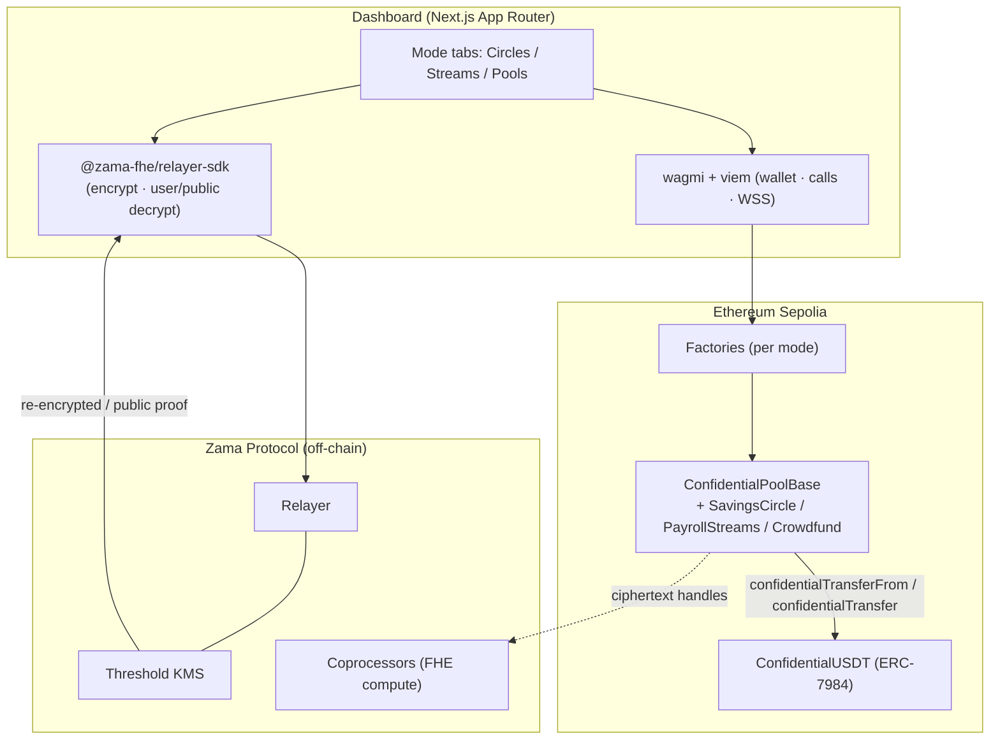

# Cowrie — Confidential Group Treasury

**One FHE engine, three modes for private group money on a public chain.**

Cowrie is a single confidential-accounting core that runs three group-money patterns
as modes of the same base contract, deployed through factories so anyone can spin up
their own instance:

| Mode | Pattern | Flow | What stays private |
|------|---------|------|--------------------|
| **Circles** | Rotating savings (ROSCA — esusu / chama / stokvel / tanda / hui) | many → rotating one | every member's contribution; the public sees only the rotation order |
| **Streams** | Confidential payroll | one → many | each salary; an employee decrypts only their own payslip |
| **Pools** | Crowdfunding (harambee) | many → one | every individual donation |

Amounts are encrypted **on a public chain** via [ERC-7984](https://docs.openzeppelin.com/confidential-contracts)
confidential tokens and the [Zama FHEVM](https://docs.zama.ai/protocol). The contracts
still compute on the encrypted values — summing a pot, comparing a hidden total to a
public goal — without ever seeing them in clear.

> The name references cowrie-shell money, the historical currency behind rotating
> savings circles. (Per the bounty rules, the project name avoids the word "Zama".)

## Why FHE is the point

In plaintext, salaries / donations / contributions leak to every observer. On a
private chain, you lose composability with public liquidity. FHE on a public chain is
the only configuration where amounts stay hidden **and** the pool still composes with
the rest of DeFi. The demo beat: an amount sitting on a block explorer as an opaque
ciphertext handle while the contract computes a payout on it.

## Accountability without exposure

Individual amounts are always private; **aggregate totals are revealable for
accountability** (encrypted on-chain, decrypted on demand via the relayer):

- **Circles** — the round **pot total** is revealable; each member's contribution is not.
- **Pools** — the **total raised** (campaign progress) is public; who gave what is not.
- **Streams** — **funded** and **collected** totals are revealable to anyone for audit;
  individual salaries stay restricted to the employee + employer.

## Feature highlights

- **Self-describing instances** — campaigns and payrolls carry a **title** (required) and
  optional **description** so participants know what they're funding / being paid for.
- **Circles** — the organizer sets one **encrypted fixed amount** so everyone pays equally;
  a **refund window** lets members reclaim a round (crisis / non-compliance).
- **Dispute & wind-down** — Circles can be **dissolved** by the organizer or by unanimous
  member vote (`approveDissolve`), permanently opening refunds (an EIP-6780 tombstone, not
  `selfdestruct`). Payrolls support **removeEmployee** and **stopAndReclaim** (return unspent
  funds to the employer).
- **Factories** — `SavingsCircleFactory` / `CrowdfundFactory` / `PayrollStreamsFactory`
  deploy instances and keep per-user registries, so the dashboard **auto-lists** the
  circles/streams/campaigns you created or joined (no hardcoded defaults). A 0.005 ETH
  anti-spam stake on campaign/stream creation is owner-withdrawable.
- **Shareable deep-links** — `?circle=` / `?stream=` / `?campaign=` URLs auto-load an
  instance then clear the query; every instance has a **Share** button.
- **Real-time** — reads stream over a WebSocket block subscription (and 30s polling
  fallback); every transaction refreshes state on success or failure.
- **Operator-approval aware** — the Approve button hides once approved and contribute/fund
  is disabled until then, so actions don't silently revert.

## Architecture



**Design decisions**

1. **Reuse the confidential-token rails.** Pools never invent a ledger — they operate on an
   ERC-7984 token; members approve the pool as an operator (`setOperator`) and it moves funds
   with `confidentialTransferFrom` / `confidentialTransfer`.
2. **Plaintext where privacy isn't the point.** Rotation order, goal/deadline, titles and
   aggregate totals are public; only individual **amounts** are encrypted.
3. **Surgical reveal.** Crowdfunding reveals only whether the goal was met (a single boolean)
   via self-relay public decryption; aggregate totals are separately revealable.
4. **ACL discipline**, centralized in `ConfidentialPoolBase`.

## Repo layout (pnpm workspace)

```
cowrie/
├── packages/contracts/   # Hardhat + FHEVM: base, three modes, three factories, token, tests
├── packages/shared/      # ABIs + deployed addresses, consumed by the web app
└── apps/web/             # Next.js App Router dashboard (FHE + wagmi)
```

## How the crowdfunding reveal works

`@fhevm/solidity` 0.11.x uses **self-relay public decryption** (no oracle):

1. `Crowdfund.finalize()` computes `reached = total >= goal`, marks it publicly decryptable,
   and emits the handle.
2. The dashboard fetches the cleartext + KMS proof via the relayer SDK `publicDecrypt`.
3. Anyone submits `settle(cleartexts, proof)`; the contract verifies with `FHE.checkSignatures`
   and flips to `Succeeded` / `Failed`. Then `release()` / `refund()` run trustlessly.

## Quick start

```bash
# Node 20+, pnpm
pnpm install
pnpm compile && pnpm test     # 21 tests on the FHEVM mock
pnpm web:dev                  # http://localhost:3000
```

**Test-wallet flow:** Faucet (mint cUSDT) → create or open an instance → **Approve operator**
→ contribute / fund privately → reveal your own balance or the aggregate total. On a block
explorer the amount is an opaque ciphertext handle.

### Deploy to Sepolia

```bash
cd packages/contracts
# .env: MNEMONIC + SEPOLIA_RPC_URL (a public endpoint works)
pnpm --filter @cowrie/contracts deploy:sepolia
```
Deploys the token + three factories (no default instances). Copy the printed addresses into
[`packages/shared/src/addresses.ts`](packages/shared/src/addresses.ts). For the web app, set
`NEXT_PUBLIC_SITE_URL` (OG image) and optionally `NEXT_PUBLIC_SEPOLIA_RPC` / `NEXT_PUBLIC_SEPOLIA_WS`.

## Deployed contracts (Sepolia)

| Contract | Address |
|----------|---------|
| ConfidentialUSDT | [`0x3f2569498053a8c7266839Ab8a4256765004970f`](https://sepolia.etherscan.io/address/0x3f2569498053a8c7266839Ab8a4256765004970f) |
| SavingsCircleFactory | [`0x57e6698810bCee8e50ec25c2e15754cAD2e7a978`](https://sepolia.etherscan.io/address/0x57e6698810bCee8e50ec25c2e15754cAD2e7a978) |
| CrowdfundFactory | [`0xaABd99a2530A8Ced89fb8e67f0746586088ba371`](https://sepolia.etherscan.io/address/0xaABd99a2530A8Ced89fb8e67f0746586088ba371) |
| PayrollStreamsFactory | [`0x0283592e5EB6f5aa058d911e71ED560d4AaD0C0F`](https://sepolia.etherscan.io/address/0x0283592e5EB6f5aa058d911e71ED560d4AaD0C0F) |

## Tech

- **Contracts:** Solidity `^0.8.27`, `@fhevm/solidity` 0.11, `@openzeppelin/confidential-contracts` 0.5, Hardhat + FHEVM plugin.
- **Frontend:** Next.js (App Router) + TypeScript + Tailwind v4, `@zama-fhe/relayer-sdk`, wagmi + viem, TanStack Query.
- **Network:** Ethereum Sepolia (chainId 11155111).

## License

BSD-3-Clause-Clear.
