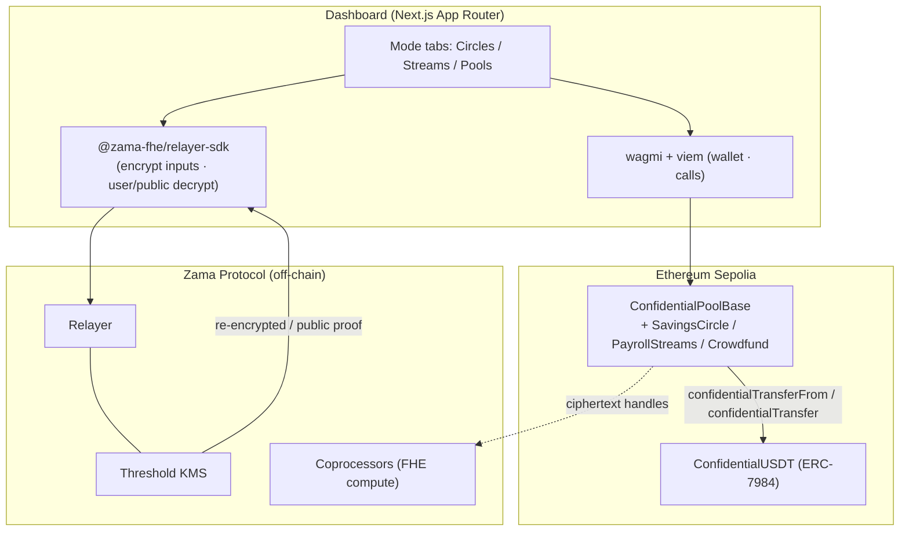

# Cowrie — Confidential Group Treasury

**One FHE engine, three modes for private group money on a public chain.**

Cowrie is a single confidential-accounting core that runs three treasury patterns
as modes of the same base contract:

| Mode | Pattern | Flow | What's revealed |
|------|---------|------|-----------------|
| **Circles** | Savings circle (ROSCA / esusu / tanda / hui) | many → rotating one | nothing but the public rotation order |
| **Streams** | Confidential payroll | one → many | nothing — each employee decrypts only their own payslip |
| **Pools** | Confidential crowdfunding | many → one | a single boolean: did the encrypted total reach the goal? |

Amounts are encrypted **on a public chain** using [ERC-7984](https://docs.openzeppelin.com/confidential-contracts)
confidential tokens and the [Zama FHEVM](https://docs.zama.ai/protocol). The contract
still computes on the encrypted values — adding contributions, comparing a hidden
total to a public goal — without ever seeing them in clear.

> The name references cowrie-shell money, the historical currency behind rotating
> savings circles. (Per the bounty rules, the project name deliberately avoids the
> word "Zama".)

## Why FHE is the point

Each mode breaks without it. In plaintext, salaries / donations / contributions
leak to every observer. On a private chain, you lose composability with public
ERC-20 liquidity. FHE on a public chain is the only configuration where amounts
stay hidden **and** the pool still composes with the rest of DeFi. The demo beat:
an amount sitting on a block explorer as an opaque ciphertext handle while the
contract computes a payout on it.

## Architecture



**Design decisions**

1. **Reuse the confidential-token rails.** The pool never invents a ledger. It
   operates on an ERC-7984 token; members approve the pool as an operator
   (`setOperator`) and the pool moves funds with `confidentialTransferFrom` (pull)
   and `confidentialTransfer` (push) — the audited, composable path.
2. **Plaintext where privacy isn't the point.** ROSCA rotation order and a
   campaign's goal/deadline are public terms. Only **amounts** are encrypted.
3. **One reveal, one boolean.** Only `Crowdfund` reveals anything, and only whether
   the goal was met — never individual contributions. This isolates the hardest
   part of the build to a single, well-contained flow.
4. **ACL discipline.** Every stored ciphertext gets `FHE.allowThis`; every value a
   user reads gets `FHE.allow`; every amount handed to the token gets
   `FHE.allowTransient`. Centralized in `ConfidentialPoolBase`.

## Repo layout (pnpm workspace)

```
cowrie/
├── packages/contracts/   # Hardhat + FHEVM: base, three modes, token mock, tests
├── packages/shared/      # ABIs + deployed addresses, consumed by the web app
└── apps/web/             # Next.js App Router dashboard (FHE + wagmi)
```

## How the reveal works (Pools)

`@fhevm/solidity` 0.11.x uses **self-relay public decryption** (there is no
decryption oracle):

1. `Crowdfund.finalize()` computes `reached = total >= goal` on the encrypted total,
   marks it publicly decryptable (`FHE.makePubliclyDecryptable`), and emits its handle.
2. Off-chain, the dashboard fetches the cleartext + KMS proof for that handle via the
   relayer SDK `publicDecrypt([handle])`.
3. Anyone submits `settle(cleartexts, proof)`; the contract verifies with
   `FHE.checkSignatures` and flips into `Succeeded` / `Failed`. Then the beneficiary
   `release()`s or contributors `refund()` — trustlessly.

## Quick start

```bash
# Node 20+, pnpm
pnpm install

# Contracts: compile + run the FHEVM mock test suite
pnpm compile
pnpm test

# Web dashboard
pnpm web:dev      # http://localhost:3000
```

### Deploy to Sepolia

```bash
cd packages/contracts
npx hardhat vars set MNEMONIC          # funded Sepolia test seed phrase
npx hardhat vars set INFURA_API_KEY
npx hardhat vars set ETHERSCAN_API_KEY # optional, for verification
pnpm --filter @cowrie/contracts deploy:sepolia
```

Copy the printed addresses into [`packages/shared/src/addresses.ts`](packages/shared/src/addresses.ts),
then `pnpm web:build`.

### Test wallet flow (the demo)

1. **Faucet** — `ConfidentialUSDT.faucet(amount)` mints test cUSDT.
2. **Approve** — `setOperator(pool, until)` lets the pool move your tokens.
3. **Contribute privately** — the amount is encrypted client-side; on a block
   explorer the input is an opaque ciphertext handle.
4. **Decrypt your share** — an EIP-712 user-decryption returns only *your* value in clear.

## Deployed addresses (Sepolia)

Deployed by `0x5C5f6520842948d39820749Ea11b594C7dF7fBb0`:

| Contract | Address |
|----------|---------|
| ConfidentialUSDT | [`0x3f2569498053a8c7266839Ab8a4256765004970f`](https://sepolia.etherscan.io/address/0x3f2569498053a8c7266839Ab8a4256765004970f) |
| SavingsCircle | [`0xF2BD85f25146440a6B1043Ffb9d5A72492Eb9BDC`](https://sepolia.etherscan.io/address/0xF2BD85f25146440a6B1043Ffb9d5A72492Eb9BDC) |
| PayrollStreams | [`0x17037e134a8Ef4a79A9a37c0Df6C0a3d758A2B2d`](https://sepolia.etherscan.io/address/0x17037e134a8Ef4a79A9a37c0Df6C0a3d758A2B2d) |
| Crowdfund | [`0xbF3B0Db37498B4CA0902e6Fe92f75BDD7e4252fb`](https://sepolia.etherscan.io/address/0xbF3B0Db37498B4CA0902e6Fe92f75BDD7e4252fb) |
| SavingsCircleFactory | [`0x29c73523715481DF8D3efcbB9ae4007DDF0a38dd`](https://sepolia.etherscan.io/address/0x29c73523715481DF8D3efcbB9ae4007DDF0a38dd) |
| CrowdfundFactory | [`0x1507Ec79d49647dc9f4AdA53dD851e9Da4CBEDD1`](https://sepolia.etherscan.io/address/0x1507Ec79d49647dc9f4AdA53dD851e9Da4CBEDD1) |
| PayrollStreamsFactory | [`0xD5551aA08128555Bc522b506240F77fEef2cb463`](https://sepolia.etherscan.io/address/0xD5551aA08128555Bc522b506240F77fEef2cb463) |

## Tech

- **Contracts:** Solidity `^0.8.27`, `@fhevm/solidity` 0.11, `@openzeppelin/confidential-contracts` 0.5, Hardhat + FHEVM plugin.
- **Frontend:** Next.js (App Router) + TypeScript + Tailwind v4, `@zama-fhe/relayer-sdk`, wagmi + viem, TanStack Query.
- **Network:** Ethereum Sepolia (chainId 11155111).

## License

BSD-3-Clause-Clear.
